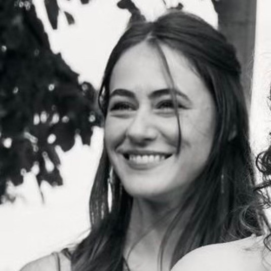
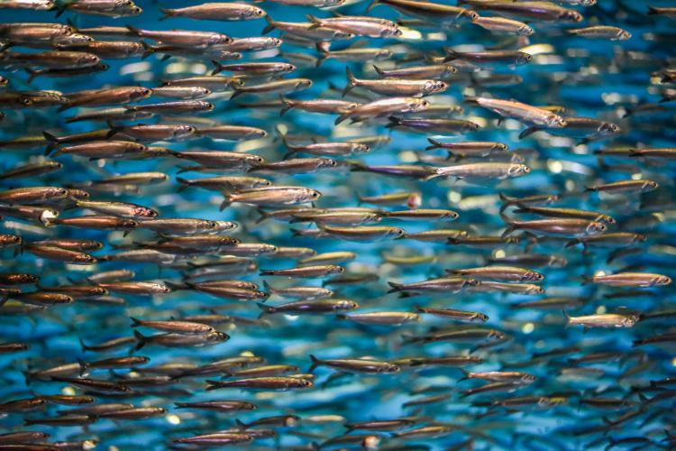

::: {.hero-image}
::: {.hero-text}

# Michelle Hauer, Ph.D.
**Molecular ecologist**

eDNA · fisheries science · quantitative ecology · population genomics · deep-sea ecology · symbiosis

:::
:::

::: {.intro-section}

## About Me

::: {.about-grid}

::: {.about-profile}

{.profile-photo}

:::

::: {.about-copy}

I am a Postdoctoral Scholar jointly appointed at the University of Washington's School of Marine and Environmental Affairs and NOAA's Northwest Fisheries Science Center, where I develop molecular and quantitative approaches for marine conservation and fisheries science. I earned my Ph.D. in Oceanography from the University of Rhode Island's Graduate School of Oceanography in 2024.

My research spans marine systems that are difficult to observe directly, from fish communities across the California Current Ecosystem to microbial symbioses at deep-sea hydrothermal vents. I am interested in how interactions among organisms shape ecological systems across scales, and how molecular tools can reveal the otherwise hidden biological patterns that underlie biodiversity, population structure, species distributions, and ecosystem dynamics.

:::

:::

::: {.section-ocean}

## Research Themes

::: {.grid}

::: {.card .research-card}

{.card-image}

### Environmental DNA & Fisheries Ecology

Marine ecosystems are vast, dynamic, and often impossible to observe directly. I am fascinated by the idea that organisms continually leave behind molecular traces that allow us to study biodiversity without capturing, disturbing, or even seeing the species themselves. Environmental DNA offers a non-invasive approach to understanding marine ecosystems while expanding the kinds of ecological questions we are able to ask.

My research combines quantitative eDNA, metabarcoding, community ecology, species co-occurrence, spatial modeling, and fisheries survey data to investigate marine biodiversity, estimate species abundance, and understand how ecological communities respond to environmental change.

*Northern Anchovy, Credit: Shutterstock*

:::

::: {.card .research-card}

{.card-image}

### Holobionts & Hydrothermal Vent Ecology

Hydrothermal vents provide a remarkable natural laboratory for exploring one of ecology's most fundamental questions: how interactions among organisms give rise to increasingly complex biological systems. I am fascinated by the ways symbioses blur the boundaries of individuality, transforming animals, their microbial symbionts, and even the viruses that infect those symbionts into tightly integrated biological systems.

My research investigates hydrothermal vent holobionts across multiple levels of biological organization, from host–microbe and phage–microbe interactions to patterns of microbial biogeography and population connectivity. By combining oceanographic fieldwork with molecular ecology, population genomics, and bioinformatics, I seek to understand how evolutionary history, dispersal, and ecological interactions shape these nested biological systems in one of Earth's most extreme environments.

*Hydrothermal vent in the Lau Basin. Image credit: WHOI, ROV Jason.*

:::

:::