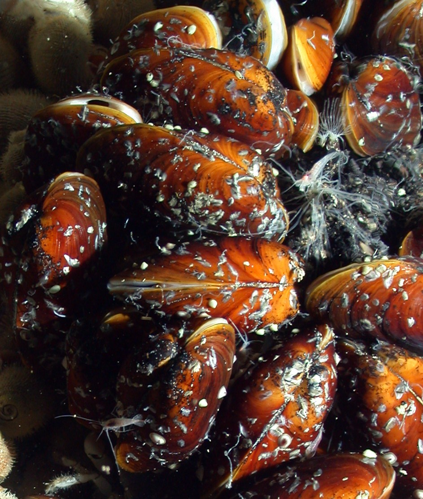
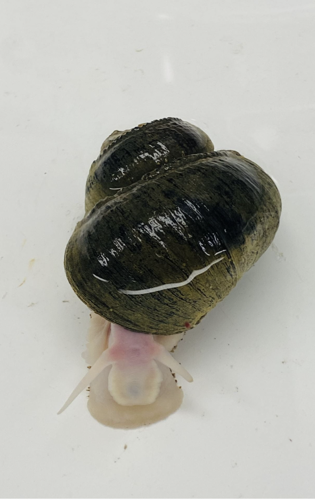
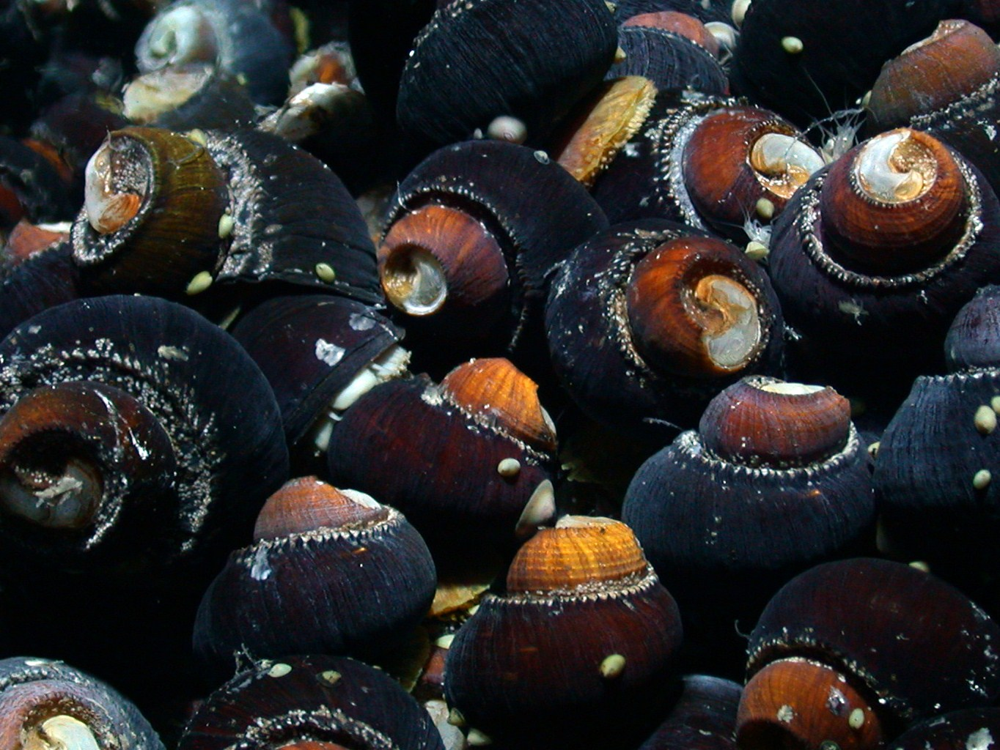

My research combines molecular ecology, quantitative modeling, oceanography, and bioinformatics to understand marine ecosystems that are difficult—or impossible—to observe directly. From hydrothermal vent symbioses thousands of meters below the ocean surface to pelagic fisheries across the California Current, I use molecular data to investigate biodiversity, species interactions, population connectivity, and ecosystem dynamics.

## Environmental DNA & Fisheries Science

{.research-banner}

Environmental DNA (eDNA) provides a powerful, non-invasive approach for monitoring marine biodiversity and fisheries resources. Rather than relying exclusively on physically capturing organisms, eDNA detects genetic material continuously released into the environment, allowing species to be surveyed from seawater alone.

My current postdoctoral research at the University of Washington and NOAA develops quantitative eDNA methods for fisheries management and ecosystem monitoring. I integrate qPCR, metabarcoding, fisheries acoustics, oceanographic sampling, and statistical modeling to investigate fish abundance, species distributions, and community composition across the California Current Ecosystem.

### Current focal species

- Pacific hake (*Merluccius productus*)
- Pacific sardine (*Sardinops sagax*)
- Northern anchovy (*Engraulis mordax*)

## Quantitative Ecology and Geospatial Modeling

{.research-banner}

One of the central goals of my research is transforming molecular observations into ecological inference.

I develop spatial and spatiotemporal statistical models that integrate environmental DNA with oceanographic variables and NOAA fisheries survey data to estimate species abundance and distribution. These approaches combine molecular ecology with quantitative ecology, geostatistics, and fisheries science to improve our ability to monitor marine populations over large spatial scales.

Current work includes:

- Geostatistical eDNA models
- Spatiotemporal abundance estimation
- Integration of acoustic survey data
- Species-specific qPCR calibration
- Uncertainty estimation for quantitative eDNA

## Population Genomics & Symbiosis at Hydrothermal Vents

::: {.banner-three}

*Image: WHOI ROV Jason*

*Image: Dexter Davis*

*Image: WHOI ROV Jason*

:::

My doctoral research focused on deep-sea hydrothermal vent ecosystems, where animals depend on microbial symbionts rather than photosynthesis for survival.

I investigate hydrothermal vent holobionts across multiple levels of biological organization—from host–microbe symbioses to bacteriophage interactions and microbial population genomics—primarily in the vent gastropod genera *Alviniconcha* and *Ifremeria* and the vent mussel genus *Bathymodiolus*. hese systems provide natural laboratories for studying evolution, dispersal, adaptation, and the emergence of biological complexity. My research examines how environmental gradients, microbial interactions, environmental disturbance, and evolutionary history shape symbiont diversity, population connectivity, abundance, and function.

## Metabarcoding & Community Ecology

{.research-banner}

Beyond species-specific analyses, I use environmental DNA metabarcoding to characterize entire marine communities.

By combining high-throughput sequencing with ecological statistics, I investigate community composition, species co-occurrence, biodiversity change through time, and ecosystem responses to environmental variability. These approaches allow us to study ecological communities at scales that are otherwise impossible using traditional sampling methods.

Applications include:

- Community composition
- Species co-occurrence
- Biodiversity monitoring
- Ecosystem assessment
- Time-series analyses